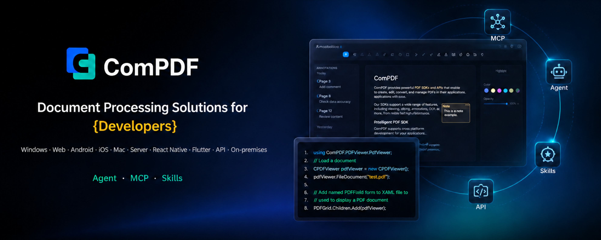

[English](README.md) | [繁體中文](README_TW.md) | [日本語](README_JA.md) | [简体中文](README_CN.md)

# ComPDF Skills

**ComPDF Skills** 為 AI Agent 提供 **PDF/圖片解析、資料擷取、文件格式轉換與 PDF 處理能力**，協助 Agent 建立完整的自動化文件處理流程。在大型模型推理前，ComPDF Skills 可先完成文件解析、OCR、資料擷取與結構化預處理，將非結構化檔案轉換為 AI 可直接理解的資料，只把必要內容傳遞給模型，進而降低 Token 消耗與模型呼叫成本，並顯著提升 Agent 的文件處理效率與回應品質。

> - 如果 ComPDF Skills 對你的工作流程有幫助，歡迎在 GitHub 給我們一個 ⭐ **Star**。
> - 如果你有問題、建議或整合需求，歡迎透過 **Issues** 與 **Discussions** 與我們交流。

<p align="center">
  <a href="https://github.com/ComPDFKit/compdf-skills"></a>
  <a href="#"></a>
  <a href="#"></a>
</p>

<p align="center">
  <a href="#為什麼選擇-compdf-skills"><b>為什麼選擇 ComPDF Skills</b></a> •
  <a href="#支援功能"><b>支援功能</b></a> •
  <a href="#license-與免費使用"><b>License 與免費使用</b></a> •
  <a href="#安裝與啟用"><b>安裝與啟用</b></a> •
  <a href="#適用情境與範例指令"><b>適用情境</b></a> •
  <a href="#支援"><b>支援</b></a>
</p>

## 為什麼選擇 ComPDF Skills

- 專業的 AI 文件處理能力：提供 PDF/圖片解析、OCR、資料擷取、格式轉換、頁面處理等能力，將非結構化文件轉換為 AI 可直接理解的結構化資料，協助 Agent 更準確地處理複雜文件。

- 更高效、更低成本的 AI 工作流程：在模型推理前先完成文件解析與預處理，只將必要內容傳遞給大型模型，降低 Token 消耗與模型呼叫成本，同時提升 Agent 的回應速度與處理效率。

- 豐富的文件格式支援：支援 Word、Excel、PowerPoint、HTML、Markdown、JSON、CSV、RTF、TXT、圖片等輸出格式，滿足不同 Agent 工作流程與商業系統的資料交換需求。

- 免費開始，輕鬆驗證價值：提供每月免費文件處理額度，足以支援日常文件處理與前期驗證需求。

## 支援功能

ComPDF Skills 為 Agent 提供文件轉換、PDF 操作，以及智慧解析與資料擷取功能，詳情如下：

### 1. PDF 解析與資料擷取

| 能力          | 說明                                            |
| ----------- | --------------------------------------------- |
| 圖片解析與資料擷取   | 從圖片檔案中擷取文字、表格、欄位與結構化內容，便於後續 AI 工作流程與自動化處理。    |
| PDF 解析與資料擷取 | 從 PDF 檔案中擷取文字、表格、欄位與結構化內容，便於後續 AI 工作流程與自動化處理。 |

### 2. PDF 與圖片轉換

| 能力             | 說明                                                                         |
| -------------- | -------------------------------------------------------------------------- |
| PDF 轉 Word     | 將 PDF 檔案轉換為可編輯的 Word 文件，並盡可能保留原始版面、文字、圖片與格式。                               |
| PDF 轉 Excel    | 將 PDF 檔案轉換為 Excel，支援表格、數字與結構化商業資料。                                         |
| PDF 轉 PPT      | 將 PDF 頁面轉換為可編輯的 PowerPoint 投影片，並盡量保留原始版面與視覺結構。                             |
| PDF 轉 HTML     | 將 PDF 檔案轉換為 HTML，用於網頁展示與內容重用，同時保留文字、圖片、表格與版面。                              |
| PDF 轉 RTF      | 將 PDF 檔案轉換為 RTF 文件，支援文字與圖片內容。                                              |
| PDF 轉圖片        | 將 PDF 頁面轉換為 PNG、JPG、JPEG、JPEG2000、BMP、TIFF、TGA、GIF、WEBP 圖片，並支援解析度與 DPI 設定。 |
| PDF 轉 CSV      | 從 PDF 檔案中擷取表格並匯出為 CSV，可依單表匯出，也可合併匯出。                                       |
| PDF 轉 TXT      | 從 PDF 或掃描版 PDF 中擷取文字，並儲存為純文字檔。                                             |
| PDF 轉 JSON     | 從 PDF 檔案中擷取文字、表格與圖片，並儲存為結構化 JSON。                                          |
| PDF 轉 Markdown | 將 PDF 檔案轉換為 Markdown，便於在知識庫、開發文件、部落格系統與 AI 工作流程中持續編輯、檢索與重用。                |
| PDF 轉可搜尋 PDF   | 對掃描版 PDF 執行 OCR，產生可搜尋、可複製、可醒目標示文字的 PDF 文件，便於檢索、歸檔與後續處理。                    |
| PDF 轉可搜尋 OFD   | 對掃描版 PDF 執行 OCR，並轉換為可搜尋的 OFD 檔案，適用於 OFD 歸檔、流轉與在地化辦公情境。                     |
| Word 轉 PDF     | 將 Word 文件轉換為 PDF，盡量保留原始排版、字型、圖片與頁面結構，適合正式分享、歸檔與列印。                         |
| PNG 轉 PDF      | 將 PNG 圖片轉換為 PDF，方便將截圖、設計稿或證據圖片統一整理、傳輸與歸檔。                                  |
| RTF 轉 PDF      | 將 RTF 文件轉換為 PDF，在保留基本文字樣式與版面的同時，方便跨裝置檢視與正式輸出。                              |
| Excel 轉 PDF    | 將 Excel 活頁簿或試算表轉換為 PDF，便於報表分享、列印、歸檔，並避免公式被誤改。                              |
| TXT 轉 PDF      | 將 TXT 純文字檔轉換為 PDF，適合將日誌、筆記、說明文件等內容整理為固定版式文件。                               |
| CSV 轉 PDF      | 將 CSV 表格資料轉換為 PDF，便於資料快照分享、審閱、列印與商業歸檔。                                     |
| PPT 轉 PDF      | 將 PowerPoint 簡報轉換為 PDF，便於簡報材料分發、跨裝置檢視與正式留存。                                |
| HTML 轉 PDF     | 將 HTML 網頁或內容片段轉換為 PDF，適合網頁留存、報告匯出、郵件內容存檔與可列印輸出。                            |
| 圖片轉 Word       | 將 JPG、JPEG、PNG、BMP 圖片檔轉換為可編輯的 Word 文件。                                     |
| 圖片轉 Excel      | 將圖片檔案轉換為 Excel 活頁簿，支援表格、文字與數字內容。                                           |
| 圖片轉 PPT        | 將圖片檔案轉換為可編輯的 PowerPoint 投影片，並盡量保留可見版面與內容結構。                                |
| 圖片轉 PDF        | 將 JPG、JPEG、PNG、BMP 等圖片檔轉換為 PDF，方便多張圖片統一彙整、分享、列印與歸檔。                        |
| 圖片轉 HTML       | 將圖片檔案轉換為 HTML，並盡量保留文字、版面、表格與主要視覺元素。                                        |
| 圖片轉 RTF        | 將圖片檔案轉換為 RTF 文件，支援擷取文字與圖片內容。                                               |
| 圖片轉 CSV        | 從圖片檔案中擷取表格並匯出為 CSV。                                                        |
| 圖片轉 TXT        | 從圖片檔案中擷取文字並儲存為純文字檔。                                                        |
| 圖片轉 JSON       | 從圖片檔案中擷取文字、表格與圖片，並儲存為結構化 JSON。                                             |

### 3. PDF 編輯與保護

| 能力        | 說明                               |
| --------- | -------------------------------- |
| 合併 PDF 檔案 | 將多個 PDF 檔案合併為一個 PDF 文件。          |
| 拆分 PDF 檔案 | 將一個 PDF 檔案拆分成多個較小的 PDF 檔案。       |
| 旋轉 PDF 頁面 | 將選定的 PDF 頁面旋轉 90、180 或 270 度。    |
| 插入 PDF 頁面 | 在現有 PDF 中插入空白頁、圖片頁或來自其他 PDF 的頁面。 |
| 刪除 PDF 頁面 | 刪除 PDF 檔案中的一個或多個頁面。              |
| 擷取 PDF 頁面 | 擷取選定頁面或頁碼範圍，並另存為新檔案。             |
| 加入浮水印     | 為 PDF 檔案加入文字或圖片浮水印，用於品牌展示或使用控管。  |
| 移除浮水印     | 從支援的 PDF 檔案中移除文字或圖片浮水印。          |
| 加密 PDF    | 使用 AES 加密與權限控制保護 PDF 檔案。         |
| 解密 PDF    | 在授權前提下移除 PDF 檔案密碼，便於內部處理或重用。     |

## License 與免費使用

安裝 ComPDF Skills 後，[註冊取得 License](https://www.compdf.com/compdf-portal/signin?utm_source=github&utm_medium=referral&utm_campaign=compdf_skills_repo_tw&ref_platform_id=github_compdfkit_skills_tw) 並將 API Key 提供給 Agents，即可開始免費使用。


## 安裝與啟用

建議優先透過 GitHub Skills 倉庫安裝，並將單一 Skill 目錄連同 `SKILL.md`、`docs/`、`scripts/` 等配套檔案一併保留。若正式對外的倉庫 URL 尚未確定，請先將下述命令中的占位符替換為實際倉庫位址或倉庫路徑。

### 1. 從 GitHub 取得 Skills

方式一：支援 Agent Skills 標準的平台，可直接透過倉庫路徑安裝：

```bash
npx skills add <owner>/<repo>/skills -y
```

方式二：手動從 GitHub 下載或複製倉庫，再複製目標 Skill 資料夾：

```bash
git clone https://github.com/ComPDFKit/compdf-skills.git
```

將目標 Skill 目錄複製到各 Agent 支援的 Skills / Rules 目錄中，並保留完整目錄結構。

### 2. 主流 Agent 產品啟用方式

#### Claude Code

1. 先安裝並登入 Claude Code。
2. 透過 GitHub Skills 安裝，或使用已發布的 Skill 安裝命令。
3. 如使用倉庫目錄方式，請將 Skill 資料夾放入 Claude Code 的 skills 目錄後重新啟動會話。
4. 在對話中直接輸入任務，或明確提及對應 Skill 名稱開始呼叫。

如平台端已發布安裝入口，可參考以下命令形式：

```bash
claude skill add <namespace>/<skill-name>
claude skill install <skill-url>
```

#### Windsurf

1. 開啟專案工作區。
2. 將從 GitHub 取得的 Skill 資料夾放入 `.windsurf/skills/compdf-skills/`，或放入跨平台代理相容目錄 `.agents/skills/compdf-skills/`。
3. 確保目錄中包含 `SKILL.md` 與所需附屬檔案。
4. 開啟 Cascade 面板後，Windsurf 會自動發現該 Skill。
5. 可直接描述任務讓 Cascade 自動呼叫，或使用 `@compdf-skills` 手動啟用。

#### Cline

1. 安裝並開啟 Cline。
2. 將從 GitHub 取得的 Skill 資料夾放入專案層級 `.cline/skills/compdf-skills/`，或全域目錄 `~/.cline/skills/compdf-skills/`。
3. 開啟 Cline 面板，點擊底部 Skills 入口，確認 Skill 已被發現並啟用。
4. 在聊天中直接輸入任務，或使用 `/compdf-skills` 明確呼叫。

#### Cursor

Cursor 目前官方文件更傾向透過 Rules 與 `AGENTS.md` 提供持久化指令，而非直接使用獨立 Skills 目錄。

1. 從 GitHub 取得 ComPDF Skills 倉庫中的核心說明檔案。
2. 將通用說明整理為專案層級規則檔案，放入 `.cursor/rules/compdf-skills.mdc`，或在專案根目錄放置 `AGENTS.md` 作為相容層。
3. 開啟 Cursor Agent / CLI，規則會依設定自動載入。
4. 在 Agent 中輸入任務，例如轉換、擷取、OCR、加浮水印等請求即可開始使用。

#### 企業內部 Agent 平台

1. 將 ComPDF Skills GitHub 倉庫鏡像到企業內部程式碼倉或製品倉。
2. 統一維護 `SKILL.md`、版本號、License 檔案與支援腳本。
3. 在企業 Agent 平台中依目錄掛載 Skills，或將核心說明轉為平台規則範本。
4. 建議採用「ComPDF 預處理 + AI 推理」工作流程：先做解析、轉換、擷取，再交由大模型進行分析與生成。

## 適用情境與範例指令

上傳 PDF、圖片或其他來源檔案，輸入任務指令，例如擷取表格、轉換格式、合併 PDF、加入浮水印。Agent 會呼叫對應的 ComPDF Skill 並返回結果。如需進一步分析，再將處理結果交給 AI。

適用情境：

* 使用者在 ChatGPT、自訂 Agent、企業 Agent 平台等環境中上傳產業報告、白皮書或提案 PDF，先轉成 Markdown / Word，再交由 AI 輸出摘要、重點觀點或內容重組結果
* 使用者在 Skills 工作流程中處理發票、對帳單、圖片表格與掃描件時，先擷取表格與結構化資料，再進入財務審核、報銷整理、系統錄入或自動化流轉
* 使用者在 Agent 中整理合約、投標書、報價單、交付文件或歸檔資料時，先完成 PDF 合併、拆分、加浮水印與格式轉換，再交給 AI 進行整理、命名或對外發送準備
* 使用者在多步驟工作流程中，先將 PDF 或圖片轉換成 CSV、JSON、TXT、Markdown 等輕量結果，再交由後續 Agent 進行欄位彙整、知識入庫、審批流程處理或自動化編排

**範例指令：**

* 將這份 PDF 轉成 Word，並盡量保留排版。
* 擷取這份 PDF 中的所有表格並匯出為 CSV。
* 將這張圖片轉成 JSON，輸出結構化內容。
* 合併這些 PDF，加入浮水印，然後返回最終檔案。
* 先將這份報告轉成 Markdown，再幫我整理重點。

## 支援

如果你有任何問題或建議，歡迎：

- 提交 `Issue`
- 參與 `Discussions`
- [聯絡 ComPDF 團隊](https://www.compdf.com/contact-sales?utm_source=github&utm_medium=referral&utm_campaign=compdf_skills_repo_tw&ref_platform_id=github_compdfkit_skills_tw)，洽詢商業授權、企業部署或規模化落地

如果 ComPDF Skills 對你的工作流程有幫助，歡迎給我們一個 ⭐ **Star**。

---

<p align="center">
  <b>由 ComPDF 團隊打造。</b><br>
  <a href="https://www.compdf.com/?utm_source=github&utm_medium=referral&utm_campaign=compdf_skills_repo_tw&ref_platform_id=github_compdfkit_skills_tw">官網</a> ·
  <a href="https://www.compdf.com/contact-sales?utm_source=github&utm_medium=referral&utm_campaign=compdf_skills_repo_tw&ref_platform_id=github_compdfkit_skills_tw">聯絡銷售</a> ·
  <a href="#安裝與啟用">安裝與啟用</a>
</p>
